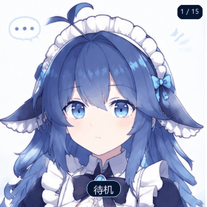
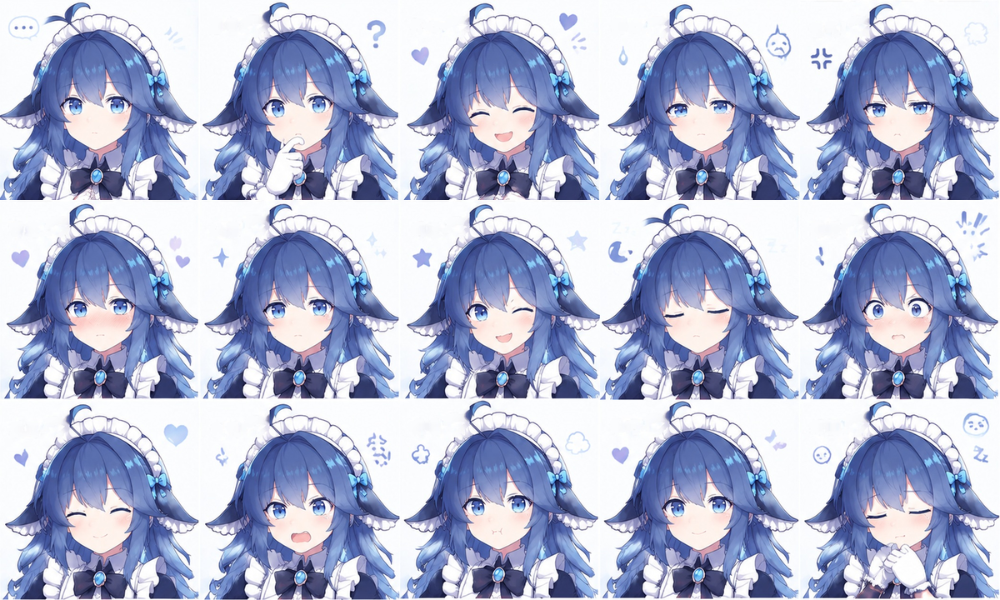

# 鲸鱼对话 · Whale Dialog

> **测试版 / Beta：0.15.9beta**
>
> 这是一个供体验和反馈的测试版本，不是正式版。功能、界面和数据格式都可能继续调整。
> 欢迎把体验问题或想法发到 [Issues](https://github.com/0nlyLetter/dsh-whale-dialog/issues)。

一个面向 **DeepSeek Harness (DSH) Web GUI** 的蓝色视觉小说式对话插件。
它把普通聊天记录替换成一幅海底舞台、一个会变化表情的鲸鱼少女，以及一个留在画面里的输入框，同时保留原会话的记忆。






## 这个版本有什么

- **侧栏原生入口**：在 DSH 侧栏新增「鲸鱼对话」，点开后先在原生页面里选择要使用的会话。
- **会话选择**：当前主会话会优先选中，也可以搜索并切换到其他会话；选好后进入该会话的鲸鱼对话。
- **背景切换**：设置 → 背景中可在 **鲸梦绘卷**（插画背景）和 **经典海底**（原来的海底动画）之间切换，两种背景都保留动态气泡；设置里带预览卡片，快速设置里也能直接切换。
- **15 种表情**：待机、思考、开心、伤心、生气、害羞、认真、调皮、困倦、惊讶、满足、生气大喊、噘嘴、乖巧、好困。
- **自动情绪**：根据用户消息里的夸奖、表白、责怪、抱怨、玩笑、惊讶、犯困等线索自动切换表情；生成回复时也会根据请求类型切换基础状态。
- **角色形象库**：默认角色是一张独立的长方形选项卡；可以用「+ 新建角色形象」创建其他角色，每个角色有独立的名字、15 张表情、缩放和焦点。
- **角色包**：可以复制角色、把单个角色导出成角色包，或从角色包导入到本地角色库。
- **数据安全**：角色立绘改用 IndexedDB 保存，设置页会显示存储方式、角色数据大小和站点用量；支持整包 JSON 备份的导出与导入，以及一键清空鲸鱼数据。
- **诊断与反馈**：诊断页显示插件版本、DSH 版本、浏览器、存储方式、角色 / 自定义表情数量和人设数量，并记录最近错误；「一键反馈」会复制诊断信息并打开预填好的 GitHub Issue。
- **蓝色海底舞台**：分层海水、光束、鲸影、鱼群、气泡、海草和柔和光晕；支持减少动态效果。
- **蓝白画框**：双层斜切边框、蝴蝶结、蕾丝、铆钉、纸鲸水印和居中的名字牌。
- **打字机显示**：点击文字可以立即显示全文；减少动态效果时直接显示完整文本。
- **提示音**：新回复到达时播放轻提示音，可关闭或调整音量。
- **画面内输入栏**：文本发送、附件、模型选择、推理强度和权限切换都留在对话框里。
- **整页历史**：可以打开完整的对话记录，不再只保留最新一条。
- **人设库**：启用人设后会自动把保存的人设代码注入输入；关闭时自动卸载。
- **设置分类**：角色与立绘、人设、情绪与表情、外观与布局、背景、动效与声音、数据与备份、诊断与反馈。

完整变更见 [CHANGELOG.md](CHANGELOG.md)。

## 安装

### 从 Git 仓库安装（推荐）

1. 打开 DSH Web GUI。
2. 进入 **插件 → 添加插件**。
3. 选择 Git 仓库，填入：

   ```text
   https://github.com/0nlyLetter/dsh-whale-dialog
   ```

4. 安装完成后启用 `@local/dsh-whale-dialog`。
5. 刷新 Web GUI。

这个仓库已经包含构建好的 `client.js`，**不需要额外安装依赖或执行构建**。

### 本地安装

把仓库放到 DSH profile 能解析到 `@local/dsh-whale-dialog` 的位置（软链接或复制到本地包目录都可以），然后在 profile 的 bundle 配置中加入：

```yaml
- insert:
    - id: whale-dialog
      name: '@local/dsh-whale-dialog'
```

启用后刷新 Web GUI。

## 使用

- **侧栏入口**：点击侧栏「鲸鱼对话」，选择会话，然后点「进入鲸鱼对话」。
- **视图标签**：也可以打开会话后，点击会话上方的「鲸鱼对话」标签。
- **当前主会话**：会话选择页会优先选中当前主会话，并显示「当前主会话」标记。
- **切换会话**：回到侧栏入口重新选择即可；角色和设置沿用当前配置。
- **换背景**：对话框右上角的快速设置里直接切换，或到设置 → 背景中选择带预览的卡片。

## 15 种表情

| 状态 | 名称 | 状态 | 名称 | 状态 | 名称 |
| --- | --- | --- | --- | --- | --- |
| 待机 | 待机 | 思考 | 思考 | 开心 | 开心 |
| 伤心 | 伤心 | 生气 | 生气 | 害羞 | 害羞 |
| 认真 | 认真 | 调皮 | 调皮 | 困倦 | 困倦 |
| 惊讶 | 惊讶 | 满足 | 满足 | 生气大喊 | 生气大喊 |
| 噘嘴 | 噘嘴 | 乖巧 | 乖巧 | 好困 | 好困 |

表情立绘都在 `assets/emotion-*.jpg`，可以替换成自己的角色图；插件会把它们内嵌进 `client.js`。
背景图在同目录的 `assets/background-*.webp`，同样以内嵌 data URL 的方式提供。

## 自动情绪规则

当前使用轻量的关键词与文本特征判断，不调用额外模型：

- 夸奖 → 开心
- 表白、喜欢 → 害羞
- 责怪、失望 → 伤心
- 轻度抱怨 → 噘嘴
- 强烈冒犯、喊叫 → 生气 / 生气大喊
- 惊讶 → 惊讶
- 玩笑、调侃 → 调皮
- 犯困、疲惫 → 困倦
- 生成回复时：请求 / 委托 → 乖巧；技术 / 提问 → 认真；日常 → 满足
- 长时间安静后 → 好困

这些规则是测试版的一部分，后续会根据反馈调整。

## 设置

设置分为几个分类：

- **角色与立绘**：角色形象库、默认角色、新建角色、复制角色、角色包导出 / 导入、15 种表情替换与恢复、缩放和焦点。
- **人设**：保存、启用和卸载人设代码。
- **情绪与表情**：自动情绪开关、表情保持时间、自定义表情。
- **外观与布局**：画框宽度、字体大小、肖像位置、纸面 / 磨砂质感、鼠标视差。
- **背景**：鲸梦绘卷 / 经典海底，带预览卡片。
- **动效与声音**：提示音开关与音量、减少动态效果。
- **数据与备份**：存储方式与用量、导出备份、导入备份、刷新用量、清空鲸鱼数据。
- **诊断与反馈**：运行环境、最近错误、复制诊断信息、一键反馈。

角色立绘保存在浏览器 IndexedDB（不支持时退回 localStorage），设置和人设保存在 localStorage。

## 数据与隐私

- 插件不包含 API key、账号凭据或服务器地址。
- 聊天内容只通过 DSH 本身的会话通道发送。
- 角色立绘、表情数据保存在当前浏览器的 IndexedDB；设置、人设保存在 localStorage。
- 备份文件只在你点击「导出备份」时生成并下载到本地，不会上传。
- 「一键反馈」只会在你确认后打开 GitHub Issues，并把诊断信息填进正文；提交前可以自行删改。
- 卸载插件不会自动删除浏览器中的数据，可在设置 → 数据与备份中清空。

## Beta 说明

当前版本是 **0.15.9beta**，主要用于收集体验反馈：

- 不是正式版，功能、交互和数据结构可能变化。
- 如果后续版本调整了存储结构，测试版中的角色或设置可能需要重新配置。
- 建议定期使用「导出备份」保存角色配置。
- 如果遇到问题，请附上 DSH 版本、浏览器和复现步骤发到 Issues；诊断页的「一键反馈」会自动带上这些信息。

## 反馈

- Issues：<https://github.com/0nlyLetter/dsh-whale-dialog/issues>
- 作者：[@0nlyLetter](https://github.com/0nlyLetter)

## License

MIT
